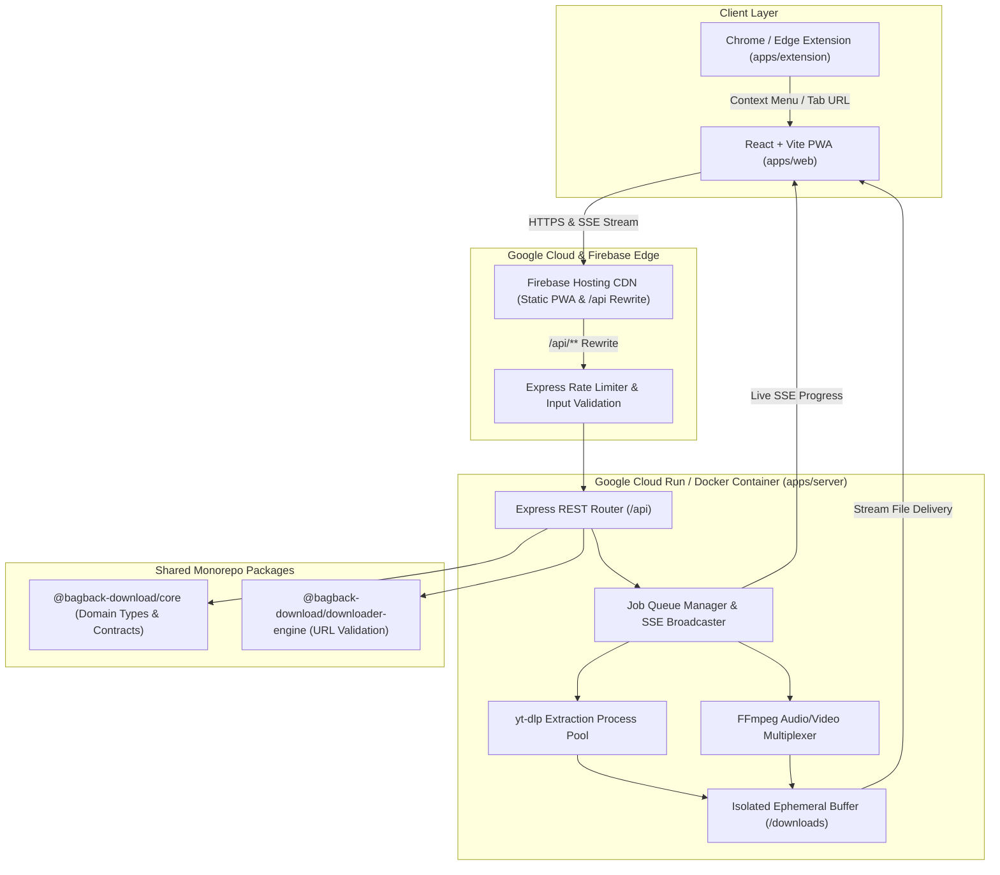

<div align="center">
  

  <h1>Bagback Download</h1>
  <p><b>Open-Source Universal Media &amp; Stream Extraction Manager</b></p>

  <p>
    <a href="https://download.bagbacktech.com"></a>
    <a href="https://www.wikidata.org/wiki/Q141252311"></a>
    <a href="https://www.typescriptlang.org/"></a>
    <a href="https://cloud.google.com/run"></a>
    <a href="https://github.com/sponsors/mohamedosamaai"></a>
    <a href="https://buymeacoffee.com/mohamedosamaai"></a>
    <a href="SECURITY.md"></a>
    <a href="LICENSE"></a>
  </p>

  <p>
    <i>Engineered by <a href="https://mohamedosama.me">Mohamed Osama</a> (Dubai, UAE) • <a href="https://bagbacktech.com">Bagback Digital Solutions</a> (CR: 218773, Tax ID: 757-139-248, Cairo, Egypt)</i>
  </p>
</div>

---

## Overview

**Bagback Download** is a fast, privacy-focused, open-source universal media and file download manager. It combines a responsive React Progressive Web App (PWA) hosted on **Firebase Hosting** with a containerized Node.js / Express extraction backend running `yt-dlp` and `FFmpeg` on **Google Cloud Run** (or standalone Docker).

All media extraction and stream multiplexing run in isolated temporary buffers with real-time Server-Sent Events (SSE) progress updates and automatic post-delivery cleanup—ensuring zero user tracking, zero analytics cookies, and zero permanent media retention.

### Key Capabilities

- **Universal Format Extraction**: Inspect and download video and audio streams across 1,000+ supported platforms with adaptive quality selection (`1080p`, `720p`, `480p`, `360p`, or `MP3` audio).
- **Real-Time Progress Streaming (SSE)**: Push-based progress updates (`0%` to `100%`) over Server-Sent Events without client polling overhead.
- **Audio & Video Multiplexing**: Automated `FFmpeg` post-processing for high-bitrate MP4 video merging and lossless MP3 audio extraction.
- **Bilingual RTL/LTR Interface**: Native Arabic (`RTL`) and English (`LTR`) support with instant language and Dark/Light theme switching.
- **Installable PWA & Local History**: Works as an installable mobile/desktop PWA with browser-local download history (`localStorage`) and optional **Dropbox Saver** cloud export.
- **Browser Extension (Manifest V3)**: Official Chrome/Edge extension (`apps/extension`) for one-click media forwarding via right-click context menus.

---

## System Architecture



---

## Repository Structure

```text
bagback-download/
├── .github/
│   ├── ISSUE_TEMPLATE/               # Structured YAML bug report & feature request forms
│   ├── workflows/
│   │   ├── ci.yml                    # Monorepo TypeScript verification & production build
│   │   ├── codeql.yml                # GitHub CodeQL static security analysis
│   │   ├── security.yml              # Secret scanning & dependency audit
│   │   ├── dependabot-auto-merge.yml # Automated minor/patch dependency verification
│   │   └── publish-package.yml       # GitHub Packages publishing with SLSA provenance
│   ├── CODEOWNERS                    # Repository ownership & review rules
│   ├── FUNDING.yml                   # GitHub Sponsors & community funding links
│   └── dependabot.yml                # Multi-workspace dependency update schedule
├── apps/
│   ├── web/                          # React + Vite + TypeScript PWA frontend
│   │   ├── public/                   # Brand icons, PWA manifest, robots.txt, sitemap.xml
│   │   └── src/
│   │       ├── app/                  # Modular application root container
│   │       ├── components/           # UI, layout (Header/Footer) & feature components
│   │       ├── lib/                  # API service client (REST/SSE) & AR/EN translations
│   │       ├── mocks/                # Offline/demo fallback handlers
│   │       ├── types/                # Frontend TypeScript contracts
│   │       ├── main.tsx              # Application entry point & PWA registration
│   │       └── styles.css            # Mobile-first RTL/LTR & Dark/Light stylesheet
│   ├── server/                       # Node.js + Express backend API service
│   │   └── src/
│   │       ├── index.ts              # REST endpoints, yt-dlp/FFmpeg runner, SSE & cleanup job
│   │       └── email.ts              # Optional SMTP download receipt helper
│   └── extension/                    # Manifest V3 browser extension (Chrome / Edge)
├── packages/
│   ├── core/                         # Shared domain models (@bagback-download/core)
│   └── downloader-engine/            # URL analysis utilities (@bagback-download/downloader-engine)
├── docs/
│   ├── architecture.md               # System topology & data flow documentation
│   ├── brand.md                      # Brand identity & visual system guidelines
│   └── clean-room-policy.md          # Clean-room engineering standards
├── .env.example                      # Environment variable template
├── .firebaserc                       # Firebase project target configuration
├── firebase.json                     # Firebase Hosting & Cloud Run rewrite rules
├── Dockerfile                        # Multi-stage production container image
├── docker-compose.yml                # Self-hosted Docker Compose configuration
├── CONTRIBUTING.md                   # Contribution workflow & commit conventions
├── CODE_OF_CONDUCT.md                # Contributor Covenant Code of Conduct
├── SECURITY.md                       # Vulnerability disclosure & security policy
├── SPEC.md                           # Product specification & scope
└── package.json                      # NPM workspaces root manifest
```

---

## Getting Started (Local Development)

### Prerequisites
- **Node.js**: `v20+`
- **Python**: `v3.10+` with `yt-dlp` installed (`pip install -U yt-dlp`)
- **FFmpeg**: Installed and available in your system `PATH`

### 1. Clone & Install Workspaces
```bash
git clone https://github.com/mohamedosamaai/bagback-download.git
cd bagback-download
npm install
```

### 2. Build Shared Packages & Server
```bash
cp .env.example .env
npm run build
```

### 3. Start Backend & Frontend
```bash
# Terminal 1 — Start Express API Server (http://localhost:4000)
npm run server:start

# Terminal 2 — Start Vite PWA Dev Server (http://localhost:5173)
npm run web:dev
```

---

## Cloud & Production Deployment

### Option 1: Google Cloud Run + Firebase Hosting (Official Production Stack)

1. **Deploy the Backend Container to Google Cloud Run**:
   ```bash
   gcloud run deploy bagback-download \
     --source . \
     --region me-central1 \
     --allow-unauthenticated \
     --port 4000 \
     --memory 1Gi
   ```
2. **Build & Deploy the Frontend PWA to Firebase Hosting**:
   ```bash
   npm run web:build
   firebase deploy --only hosting
   ```
   *(Requests to `/api/**` are automatically routed to the `bagback-download` Cloud Run service via `firebase.json`.)*

### Option 2: Docker Compose (Self-Hosted)

Build and run the complete full-stack container (including Node.js 20, Python 3.12, `yt-dlp`, Deno, FFmpeg, and the compiled static frontend) with a single command:

```bash
docker compose up -d --build
```
The application will be served at `http://localhost:4000` with health monitoring at `GET /api/health`.

---

## Browser Extension Setup

1. Open Chrome or Edge and navigate to `chrome://extensions/`.
2. Enable **Developer mode** in the top-right corner.
3. Click **Load unpacked** and select the `apps/extension` directory from this repository.
4. Right-click any media link or page and select **"Download with Bagback"** to send it directly to the downloader.

---

## Verified Authority & Accreditations

- **Wikidata Entity**: [`Q141252311`](https://www.wikidata.org/wiki/Q141252311)
- **Bagback Digital Solutions**: CR `218773` | Tax ID `757-139-248` (Cairo, Egypt)
- **Founder & Lead Architect**: [Mohamed Osama](https://mohamedosama.me) (Dubai, United Arab Emirates)
- **Dubai Chamber of Digital Economy**: Notable Contribution Award (`MeYYoRxN`)
- **Google Cloud**: Vertex AI Studio Practitioner ID `#24009731`
- **Google Skillshop**: Conversion Rate Optimization Certification ID `#192682733`
- **Semrush Academy**: Technical SEO & Content Marketing ID `#807156`

---

## Contributing & Governance

Contributions are welcome! Please review [CONTRIBUTING.md](CONTRIBUTING.md), [CODE_OF_CONDUCT.md](CODE_OF_CONDUCT.md), and [docs/clean-room-policy.md](docs/clean-room-policy.md) before submitting a pull request.

## License

Distributed under the [MIT License](LICENSE).  
Copyright © 2026 **Mohamed Osama** & **Bagback Digital Solutions**.
