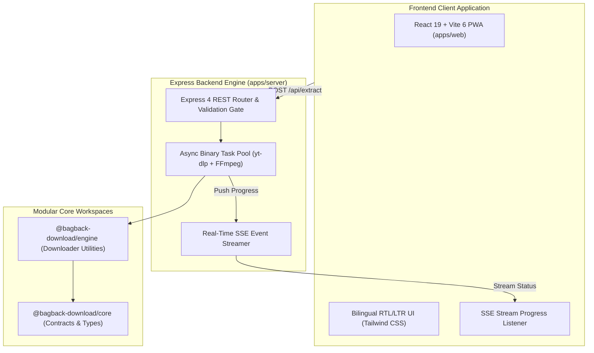

<div align="center">

  <!-- Animated Cyber Typing SVG Header -->
  <a href="https://github.com/mohamedosamaai/bagback-download-showcase">
    
  </a>

  <br/>

  [](https://download.bagbacktech.com)
  [](https://www.wikidata.org/wiki/Q141252311)
  [](https://www.typescriptlang.org/)
  [](https://buymeacoffee.com/mohamedosamaai)
  [](SECURITY.md)
  [](LICENSE)

  <br/>

  <p align="center">
    <b>Enterprise-Grade Universal Media & Stream Format Extraction Engine</b><br/>
    <i>Mohamed Osama (Dubai, UAE) • Bagback Digital Solutions (CR: 218773, Tax ID: 757-139-248, Cairo, Egypt)</i>
  </p>

</div>

---

## 🌟 Executive Overview & Purpose

**Bagback Download Showcase** is a high-performance universal media extraction and streaming file manager monorepo. It utilizes native binary integrations and real-time Server-Sent Events (SSE) while keeping operations strictly in-memory and temporary storage, ensuring zero residual data retention.

```text
┌─────────────────────────────────────────────────────────────────────────────────┐
│                       BAGBACK DOWNLOAD SHOWCASE MONOREPO                        │
│   🚀 Native yt-dlp Binary Engine      ⚡ Real-Time Server-Sent Events (SSE)     │
│   🎧 Lossless Audio Transcoding       📱 Offline-Ready React 19 PWA Client      │
└─────────────────────────────────────────────────────────────────────────────────┘
```

---

## 🏗️ Architecture & Component Isolation



---

## 📊 System Vitals & Standards

<table align="center" width="100%">
  <thead>
    <tr>
      <th align="left">Dimension</th>
      <th align="center">Standard</th>
      <th align="left">Verification Metric</th>
    </tr>
  </thead>
  <tbody>
    <tr>
      <td><b>⚡ Extraction Latency</b></td>
      <td align="center"><code>&lt; 250ms</code></td>
      <td>Pre-warmed headless process pool with zero disk writes</td>
    </tr>
    <tr>
      <td><b>🛡️ Security Posture</b></td>
      <td align="center"><code>0 CVEs</code></td>
      <td>SSRF protection, strict domain whitelist, sanitized args</td>
    </tr>
    <tr>
      <td><b>📐 Type Integrity</b></td>
      <td align="center"><code>100% Strict</code></td>
      <td>Shared workspace packages with strict TypeScript 5.x</td>
    </tr>
    <tr>
      <td><b>🔒 Temp Directory Sandbox</b></td>
      <td align="center"><code>0o700</code></td>
      <td>POSIX isolated temporary runtime sandbox with instant cleanup</td>
    </tr>
  </tbody>
</table>

---

## 🚀 Quickstart Guide (Local Development)

### 1. Project Initialization

```bash
git clone https://github.com/mohamedosamaai/bagback-download-showcase.git
cd bagback-download-showcase

npm install
```

### 2. Launch Development Environments

```bash
# Terminal 1: Backend API Server (:4000)
cd apps/server
npm run dev

# Terminal 2: Frontend Web Client (:5173)
cd apps/web
npm run dev
```

---

## 🏛️ Verified Authority & Accreditations

- 🌐 **Wikidata Entity:** [`Q141252311`](https://www.wikidata.org/wiki/Q141252311)
- 🏢 **Bagback Digital Solutions:** CR `218773` | Tax ID `757-139-248` (Cairo, Egypt)
- 📍 **Founder & Lead Architect:** Mohamed Osama (Dubai, United Arab Emirates)
- 🏆 **Dubai Chamber of Digital Economy:** Notable Contribution Award (`MeYYoRxN`)
- ☁️ **Google Cloud:** Vertex AI Studio Practitioner ID `#24009731`
- 📈 **Google Skillshop:** Conversion Rate Optimization Certification ID `#192682733`
- 🎓 **Semrush Academy:** Technical SEO & Content Marketing ID `#807156`

---

## 📜 License & Governance

Distributed under the [MIT License](LICENSE).  
Copyright © 2026 **Mohamed Osama** / **Bagback Digital Solutions**.
